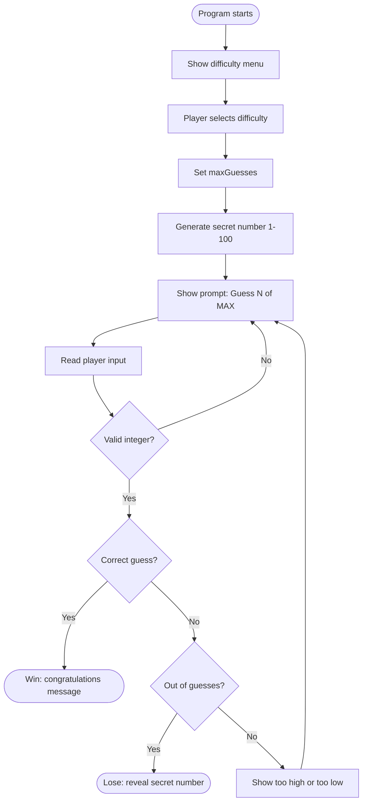

<!-- Last updated: 2026-05-06 -->
<!-- Last change: Initial architecture document -->

# Guessing Game - Technical Architecture

## System Overview

A single-process C# console application. The player runs the program, selects a difficulty, then guesses a randomly generated number with feedback after each wrong guess. No external services, no database, no network communication. The entire game runs in one session.

## Component Breakdown

All logic lives in `Program.cs` inside the `Main` method. The method is divided into three conceptual sections:

### 1. Difficulty Selection

Displays a menu and reads the player's choice. Maps the choice to a `maxGuesses` value.

| Difficulty | Guesses |
|------------|---------|
| Easy       | 8       |
| Medium     | 6       |
| Hard       | 4       |
| Cheater    | Unlimited |

For Cheater mode, `maxGuesses` is set to `int.MaxValue` so the out-of-guesses check never triggers in the loop.

### 2. Game Setup

Generates the secret number using `new Random().Next(1, 101)`. The upper bound in `Next()` is exclusive, so passing `101` gives a range of 1-100 inclusive. This is a common C# gotcha.

### 3. Game Loop

A `for` or `while` loop that:
1. Displays the current guess number and guesses remaining
2. Reads and parses the player's input with `int.TryParse`
3. Checks for a win and breaks out of the loop on a correct guess
4. Checks if guesses are exhausted
5. Shows "too high" or "too low" for wrong guesses

## Data Model

No persistent storage. All game state lives in local variables inside `Main`.

| Variable      | Type   | Purpose |
|---------------|--------|---------|
| `secretNumber`| `int`  | The number the player is guessing (1-100) |
| `maxGuesses`  | `int`  | Maximum allowed attempts, set by difficulty selection |
| `guessCount`  | `int`  | How many guesses have been made so far |
| `playerGuess` | `int`  | The player's current parsed input |
| `won`         | `bool` | Tracks a correct guess so the post-loop message can say win or lose |

## Infrastructure and Deployment

| Concern      | Detail |
|--------------|--------|
| Runtime      | .NET console application |
| Run command  | `dotnet run` from the project folder |
| Build        | `dotnet build` |
| Dependencies | None (standard library only) |

## Key Technical Decisions

**Single-file, all-in-Main structure.** This matches the current learning phase. The goal is fluency with C# basics: variables, loops, conditionals, and console I/O. No classes or helper methods are needed for a program of this scope.

**`int.TryParse` for input handling.** Safer than `int.Parse` because it does not throw an exception on invalid input. It returns `false` if the string cannot be converted, letting you re-prompt the player cleanly without a try/catch.

**Cheater mode via `int.MaxValue`.** Representing "unlimited guesses" as the largest possible integer means the loop logic stays the same for every difficulty. The out-of-guesses check just never fires.

**`Random.Next(1, 101)` for the 1-100 range.** Because the upper bound is exclusive, you need `101`, not `100`. Worth getting right early and noting in code.

## Project Conventions

### Development Philosophy

Build in phases. Each phase must be committed and working before the next one starts. No phase should break what the previous one delivered.

### Code Style

- Descriptive variable names: `secretNumber` not `n`, `guessCount` not `i`
- No leftover debug output: remove any `Console.WriteLine` calls added just to test something
- Keep the loop body readable: a short inline comment labeling a section (e.g., `// input validation`) is fine when it aids navigation

### Error Handling

The only user input that needs validation is the guess itself. Use `int.TryParse` and re-prompt on failure. Difficulty menu selection can be handled with a simple `if/else` or `switch`.

### Commits

One commit per phase, after the phase is working. Commit message should describe what the phase adds (e.g., `added difficulty selection`).
